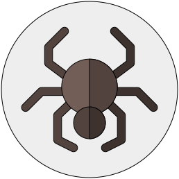

# CrawlerDetect plugin for Craft 3

Detect bots/crawlers/spiders in Craft 3.



&nbsp;

---

### Installation

Open your terminal and go to your Craft project:

```bash
cd /path/to/project
```

Then tell Composer to load the plugin:

```bash
composer require leowebguy/craft-crawler-detect
```

In the Control Panel, go to Settings → Plugins and click the “Install” button for Crawler Detect.

---

### Overview

A wrapper for the [CrawlerDetect](https://github.com/JayBizzle/Crawler-Detect) by Mark Beech.

---

### Usage

The plugin exposes a Crawler Detect's methods, and can be used in your Twig:

```twig
{{ craft.crawlerDetect.isCrawler ? 'I am a crawler.' : 'I am not crawler.' }}
```

```twig
 .. 
```

Also passing user agent as string:
```twig
 .. 
```
