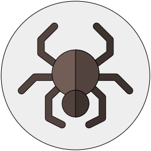

# CrawlerDetect plugin for Craft 3

Detect bots/crawlers/spiders in Craft 3.



### Requirements

This plugin requires Craft CMS 3.0.0 or later.

### Installation

To install the plugin, follow these instructions.

1. Open your terminal and go to your Craft project:

        cd /path/to/project

2. Then tell Composer to load the plugin:

        composer require leowebguy/craft-crawler-detect

3. In the Control Panel, go to Settings → Plugins and click the “Install” button for Crawler Detect.

## CrawlerDetect Overview

A wrapper for the [CrawlerDetect](https://github.com/JayBizzle/Crawler-Detect) by Mark Beech.

## Using CrawlerDetect

The plugin exposes a Crawler Detect's methods, and can be used in your Twig:

```twig
{{ craft.crawlerDetect.isCrawler ? 'I am a crawler.' : 'I am not crawler.' }}
```

```twig
 .. 
```

Also passing user agent as a string:
```twig
 .. 
```
